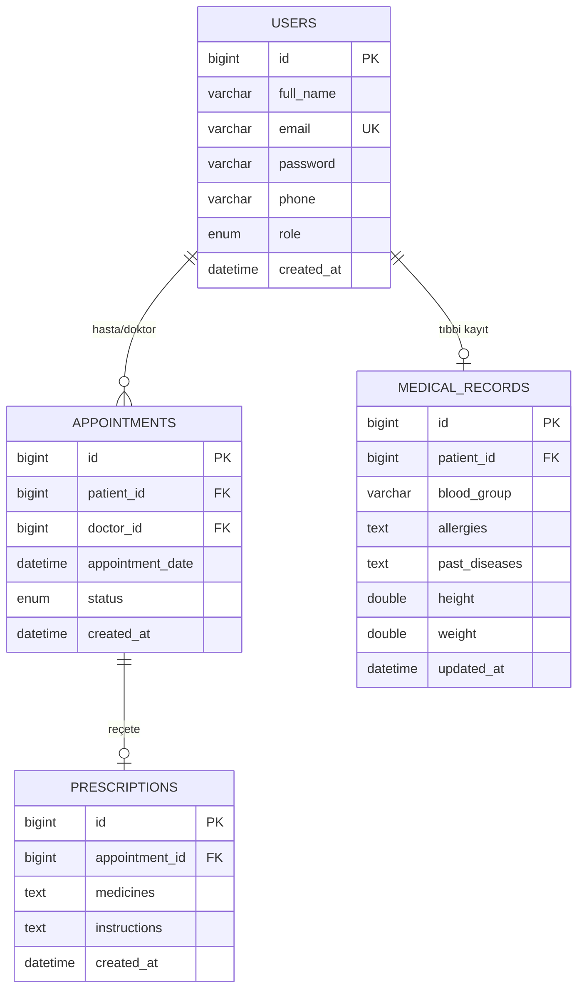

# 🏥 HealthTech – Proje Akışı ve Haftalık İlerleme

Bu doküman, **HealthTech (Tele-Sağlık Platformu)** projesinin haftalık ilerleme durumunu, ekip üyelerinin katkılarını ve tüm görev çıktılarını içerir.

Proje; sağlık hizmetlerine erişimi kolaylaştırmak, hasta ve doktor arasındaki iletişimi dijital ortama taşımak ve uzaktan sağlık hizmetlerini daha verimli hale getirmek amacıyla geliştirilmektedir.

---

## 👥 Proje Ekibi

| İsim | Rol |
|------|-----|
| Halid Hacbekkur | Scrum Master & Proje Yönetimi |
| Cena İsmail | Frontend Geliştirme / Mobil Analiz |
| Zelal Ergin | Backend Geliştirme / Altyapı |
| Nedim İsa | Gereksinim Toplama ve Belgeleme |
| Ahmet Akif Yılmaz | Veritabanı Tasarımı & Güvenlik |

---

# 📅 HAFTA 1 (9–15 Mart)

### 🎯 Sprint Goal

Projenin temel altyapısını kurmak, ekip görevlerini netleştirmek ve sistemin genel işleyişini tanımlamak.

### 📋 Görev Durumu

| Görev | Sorumlu | Durum |
|-------|---------|-------|
| G1: Mobil Uygulama Gereksinim Analizi | Cena İsmail | ✅ Tamamlandı |
| G2: Spring Boot Altyapısı ve API Tasarımı | Zelal Ergin | ✅ Tamamlandı |
| G3: Veritabanı Şema Tasarımı | Halit Hacbekkur | ✅ Tamamlandı |
| G4: Paydaş Analizi ve İletişim Planı | Nedim İsa | ✅ Tamamlandı |
| G5: Video Konferans Araştırması | Ahmet Akif Yılmaz | ✅ Tamamlandı |

---

## 📱 Görev 1: Mobil Uygulama Gereksinim Analizi
**Sorumlu:** CENA İSMAİL

### Hasta Gereksinimleri

| ID | Gereksinim | Öncelik | Durum |
|----|-----------|---------|-------|
| H-01 | E-posta ve şifre ile kayıt olma | Yüksek | ✅ Mevcut |
| H-02 | Güvenli giriş yapma (JWT) | Yüksek | ✅ Mevcut |
| H-03 | Profil bilgilerini görüntüleme | Yüksek | ✅ Mevcut |
| H-04 | Profil bilgilerini güncelleme | Orta | ✅ Mevcut |
| H-05 | Şifre değiştirme | Orta | 🔧 Hafta 4 |
| H-06 | Profil fotoğrafı yükleme | Düşük | 🔧 Hafta 4 |
| H-07 | Uzmanlık alanına göre doktor arama | Yüksek | 🔧 Hafta 4 |
| H-08 | Doktor müsaitlik takvimi görüntüleme | Yüksek | 🔧 Hafta 4 |
| H-09 | Randevu oluşturma | Yüksek | ✅ Mevcut |
| H-10 | Randevularımı listeleme | Yüksek | ✅ Mevcut |
| H-11 | Randevu iptal etme | Yüksek | ✅ Mevcut |
| H-12 | Randevu hatırlatma bildirimi | Orta | 🔧 Hafta 5 |
| H-13 | Tıbbi kayıtlarımı görüntüleme | Yüksek | ✅ Mevcut |
| H-14 | Reçetelerimi görüntüleme | Yüksek | ✅ Mevcut |
| H-15 | Sağlık geçmişi özeti | Orta | 🔧 Hafta 4 |
| H-16 | Video görüşme başlatma | Yüksek | 🔧 Hafta 4 |
| H-17 | Görüşme sırasında mesajlaşma | Orta | 🔧 Hafta 4 |
| H-18 | Görüşme geçmişi | Düşük | 🔧 Hafta 4 |

### Doktor Gereksinimleri

| ID | Gereksinim | Öncelik | Durum |
|----|-----------|---------|-------|
| D-01 | Giriş (DOCTOR rolü) | Yüksek | ✅ Mevcut |
| D-02 | Profil ve uzmanlık yönetimi | Yüksek | ✅ Mevcut |
| D-03 | Çalışma saatleri belirleme | Orta | 🔧 Hafta 4 |
| D-04 | Randevu taleplerini listeleme | Yüksek | ✅ Mevcut |
| D-05 | Randevuyu onaylama | Yüksek | ✅ Mevcut |
| D-06 | Randevuyu iptal etme | Yüksek | ✅ Mevcut |
| D-07 | Randevu takvimi görünümü | Orta | 🔧 Hafta 3 |
| D-08 | Hasta tıbbi kaydı görüntüleme | Yüksek | ✅ Mevcut |
| D-09 | Tıbbi kayıt oluşturma/güncelleme | Yüksek | ✅ Mevcut |
| D-10 | Reçete yazma | Yüksek | ✅ Mevcut |
| D-11 | Hasta listesi görüntüleme | Orta | 🔧 Hafta 4 |
| D-12 | Video görüşme başlatma | Yüksek | 🔧 Hafta 4 |
| D-13 | Görüşme sırasında not alma | Orta | 🔧 Hafta 4 |

### Kullanıcı Hikayeleri

| ID | Hikaye | Kabul Kriteri |
|----|--------|---------------|
| US-01 | Hasta olarak sisteme kayıt olup giriş yapabilmek istiyorum | JWT token ile giriş, hatalı bilgide uyarı |
| US-02 | Hasta olarak uzmanlığa göre doktor arayabilmek istiyorum | Filtreleme, kart görünümünde listeleme |
| US-03 | Hasta olarak online randevu alabilmek istiyorum | Müsait saatlerden seçim, onay mesajı |
| US-04 | Hasta olarak video görüşme başlatabilmek istiyorum | "Görüşme Başlat" butonu, kamera/mikrofon izni |
| US-05 | Hasta olarak tıbbi kayıtlarımı görüntüleyebilmek istiyorum | Kan grubu, alerji, reçete listesi |
| US-06 | Hasta olarak randevularımı yönetebilmek istiyorum | Filtreleme, iptal onay kutusu |
| US-07 | Doktor olarak randevu taleplerini onaylayabilmek istiyorum | Tek tıkla onaylama/reddetme |
| US-08 | Doktor olarak hasta kayıtlarını güncelleyebilmek istiyorum | Tüm kayıtlara erişim, yeni kayıt oluşturma |
| US-09 | Doktor olarak reçete yazabilmek istiyorum | İlaç adı, dozaj, talimat girişi |
| US-10 | Doktor olarak video görüşme yapıp not alabilmek istiyorum | Karşı kamera, not alanı |
| US-11 | Doktor olarak çalışma saatlerimi belirleyebilmek istiyorum | Haftalık takvim, müsait saat seçimi |

### Kullanım Senaryoları

**Senaryo 1 – Hasta Randevu Alma:**
Hasta giriş yapar → Doktor arar → Müsait saati seçer → Randevu oluşturur → Onay bekler

**Senaryo 2 – Doktor Randevu Onaylama:**
Doktor giriş yapar → Bekleyen talepleri görür → Onayla/Reddet → Video görüşme → Tıbbi kayıt + Reçete

**Senaryo 3 – Video Görüşme:**
Her iki taraf "Başlat" tıklar → Bekleme odası → Görüşme başlar → Kamera/mikrofon/paylaşım → Sonlandır → COMPLETED

### Güvenlik Gereksinimleri

| ID | Gereksinim |
|----|-----------|
| SEC-01 | JWT Token tabanlı kimlik doğrulama |
| SEC-02 | BCrypt şifre hashing, min 8 karakter |
| SEC-03 | HTTPS/TLS 1.3 şifreli veri transferi |
| SEC-04 | RBAC rol bazlı erişim kontrolü |
| SEC-05 | JWT token 24 saat geçerlilik süresi |
| SEC-06 | KVKK / GDPR uyumu |
| SEC-07 | Hassas tıbbi verilerin şifrelenmesi |
| SEC-08 | XSS, SQL Injection koruması |
| SEC-09 | Video görüşme E2E şifreleme |
| SEC-10 | Kritik işlemlerde audit log |

### Gereksinim Özeti: 55 gereksinim → 20 mevcut ✅, 35 planlandı 🔧

---

## 📡 Görev 2: Spring Boot Proje Altyapısı ve API Tasarımı
**Sorumlu:** ZELAL ERGİN

### Proje Altyapısı

| Bileşen | Teknoloji |
|---------|-----------|
| Framework | Spring Boot 4.0.6 |
| Dil | Java 17 |
| Veritabanı | MySQL 8.x |
| ORM | Spring Data JPA + Hibernate |
| Güvenlik | Spring Security + JWT (jjwt 0.12.6) |
| API Dokümantasyonu | springdoc-openapi 2.8.8 (Swagger) |

### API Endpoint'leri

**🔐 Authentication (`/api/auth`)**

| Method | Endpoint | Açıklama | Yetki |
|--------|----------|----------|-------|
| POST | `/api/auth/register` | Yeni kullanıcı kaydı | Herkese açık |
| POST | `/api/auth/login` | Giriş (JWT token alır) | Herkese açık |

**👥 User Management (`/api/users`)**

| Method | Endpoint | Açıklama |
|--------|----------|----------|
| GET | `/api/users` | Tüm kullanıcıları listele |
| GET | `/api/users/{id}` | ID ile kullanıcı getir |
| GET | `/api/users/me` | Kendi profilimi getir |
| POST | `/api/users` | Yeni kullanıcı oluştur |
| PUT | `/api/users/{id}` | Kullanıcı güncelle |
| DELETE | `/api/users/{id}` | Kullanıcı sil |

**📅 Appointments (`/api/appointments`)**

| Method | Endpoint | Açıklama | Yetki |
|--------|----------|----------|-------|
| POST | `/api/appointments` | Randevu oluştur | Hasta |
| GET | `/api/appointments/my` | Hastanın randevuları | Hasta |
| GET | `/api/appointments/doctor` | Doktorun randevuları | Doktor |
| PUT | `/api/appointments/{id}/cancel` | Randevu iptal | Herkes |
| PUT | `/api/appointments/{id}/approve` | Randevu onayla | Sadece DOCTOR |

**🏥 Medical Records (`/api/medical-records`)**

| Method | Endpoint | Açıklama | Yetki |
|--------|----------|----------|-------|
| GET | `/api/medical-records/my` | Kendi tıbbi kaydım | Sadece PATIENT |
| POST | `/api/medical-records/my` | Tıbbi kayıt oluştur/güncelle | Sadece PATIENT |
| GET | `/api/medical-records/patient/{id}` | Hasta kaydını görüntüle | Sadece DOCTOR |

**💊 Prescriptions (`/api/prescriptions`)**

| Method | Endpoint | Açıklama | Yetki |
|--------|----------|----------|-------|
| POST | `/api/prescriptions` | Reçete oluştur | Sadece DOCTOR |
| GET | `/api/prescriptions/my` | Reçetelerimi görüntüle | Sadece PATIENT |

### Güvenlik Yapılandırması

* `/api/auth/**` → Herkese açık
* `/swagger-ui/**`, `/v3/api-docs/**` → Herkese açık
* `/api/appointments/*/approve` → Sadece DOCTOR
* Diğer tüm endpoint'ler → Giriş yapmış kullanıcı (authenticated)

### Swagger UI: `http://localhost:8080/swagger-ui/index.html`

---

## 🗄️ Görev 3: Veritabanı Şema Tasarımı ve Modelleme
**Sorumlu:** HALİT HACBEKKUR

### ER Diyagramı



### Tablo Özeti

| Tablo | Açıklama | İlişki |
|-------|----------|--------|
| `users` | Tüm kullanıcılar (hasta/doktor/admin) | — |
| `appointments` | Randevular | patient_id, doctor_id → users |
| `medical_records` | Tıbbi kayıtlar | patient_id → users (OneToOne) |
| `prescriptions` | Reçeteler | appointment_id → appointments (OneToOne) |

### Enum Değerleri

* **Role:** `PATIENT`, `DOCTOR`, `ADMIN`
* **AppointmentStatus:** `PENDING`, `APPROVED`, `CANCELLED`, `COMPLETED`

---

## 👥 Görev 4: Paydaş Analizi ve İletişim Planı
**Sorumlu:** NEDİM İSA

### Paydaşlar

| Paydaş | Rol | Ana İhtiyaç |
|--------|-----|-------------|
| Hasta | Son Kullanıcı | Kolay randevu, video görüşme, tıbbi kayıt takibi |
| Doktor | Hizmet Sağlayıcı | Randevu yönetimi, reçete yazma, hasta takibi |
| Admin | Platform Yöneticisi | Kullanıcı yönetimi, güvenlik kontrolü |
| Sağlık Personeli | Destek | Hasta bilgilerine erişim, randevu takibi |
| Proje Ekibi | Geliştirici | Projeyi geliştirme ve test etme |
| Proje Danışmanı | Denetleyici | İlerleme takibi, değerlendirme |
| Sağlık Kurumu | Kurumsal | Platformun güvenli kullanımı |

### İletişim Planı

| Kanal | Sıklık | Katılımcılar | Amaç |
|-------|--------|-------------|------|
| WhatsApp Grubu | Günlük | Tüm ekip | Anlık iletişim |
| GitHub Issues/PR | Her commit | Tüm ekip | Kod inceleme, hata takibi |
| Haftalık Toplantı | Haftada 1 | Tüm ekip | Sprint planlaması |
| Ders Saati | Haftada 1 | Ekip + Danışman | İlerleme sunumu |

### Eskalasyon: Ekip → Scrum Master (Halit) → Proje Danışmanı

---

## 🎥 Görev 5: Video Konferans Modülü Araştırması
**Sorumlu:** AHMET AKİF YILMAZ

### Karşılaştırma

| Kriter | Jitsi Meet | Zoom SDK | Twilio | OpenVidu |
|--------|-----------|----------|--------|----------|
| Maliyet | Ücretsiz | ~$10/ay | ~$0.004/dk | Ücretsiz (CE) |
| Açık Kaynak | ✅ | ❌ | ❌ | ✅ |
| Entegrasyon | Kolay | Zor | Orta | Orta |
| WebRTC | ✅ | Kısmi | ✅ | ✅ |
| E2E Şifreleme | ✅ | ✅ | ✅ | Kısmi |
| Spring Boot Uyumu | Kolay | Zor | Orta | İyi |
| **Genel Puan** | ⭐⭐⭐⭐⭐ | ⭐⭐⭐ | ⭐⭐⭐ | ⭐⭐⭐⭐ |

### ✅ Seçilen Çözüm: Jitsi Meet

**Seçim Gerekçeleri:**
* Sıfır lisans maliyeti — eğitim projesi için ideal
* Açık kaynak (Apache 2.0)
* iframe ile kolay Angular entegrasyonu
* WebRTC standardı, ek plugin gerektirmez
* End-to-end şifreleme desteği

### Entegrasyon Yol Haritası

| Faz | Hafta | Görev |
|-----|-------|-------|
| Faz 1 | 1. Hafta | Araştırma + Angular VideoCallComponent |
| Faz 2 | 2. Hafta | JWT tabanlı oda oluşturma, güvenlik |
| Faz 3 | 3. Hafta | Ekran paylaşımı, kayıt, chat |
| Faz 4 | 4. Hafta | Performans testleri, son düzeltmeler |

---

# 📅 HAFTA 2 – Backend Geliştirme ve İyileştirme

### 🎯 Sprint Goal

Backend kodunu güçlendirmek: güvenlik iyileştirmeleri, iş kuralları, hata yönetimi ve dokümantasyon.

### 📋 Görev Durumu

| Görev | Sorumlu | Durum |
|-------|---------|-------|
| G6: RBAC güçlendirme ve güvenlik | Ahmet Akif Yılmaz | ✅ Tamamlandı |
| G7: Randevu iş kuralları ve durum geçişleri | Zelal Ergin | ✅ Tamamlandı |
| G8: Tıbbi kayıt ve reçete iyileştirme | Halit Hacbekkur | ✅ Tamamlandı |
| G9: Global hata yönetimi güçlendirme | Nedim İsa | ✅ Tamamlandı |
| G10: README ve proje dokümantasyonu | Cena İsmail | ✅ Tamamlandı |

---

## 🔐 G6: RBAC Güçlendirme ve Güvenlik İyileştirmeleri
**Sorumlu:** AHMET AKİF YILMAZ

### Yapılan İşlemler:
* JWT token süresi **1 saatten 24 saate** çıkarıldı (SEC-05 gereksinimi)
* Secret key güçlendirildi (256-bit, 46 karakter)
* `isTokenExpired()` metodu eklendi — token süre kontrolü
* `isTokenValid()` metodu eklendi — email eşleşmesi + süre kontrolü

### Güncellenen Dosya:
* `JwtService.java`

---

## 📅 G7: Randevu Modülü İş Kuralları
**Sorumlu:** ZELAL ERGİN

### Yeni İş Kuralları:
1. **Doktor rol kontrolü:** Sadece DOCTOR rolündeki kullanıcıya randevu alınabilir
2. **Geçmiş tarih kontrolü:** Geçmiş bir tarihe randevu oluşturulamaz
3. **Durum geçiş kuralları:**

```
PENDING → APPROVED → COMPLETED
   ↓         ↓
CANCELLED  CANCELLED
```

* Sadece **PENDING** → APPROVED (doktor onaylar)
* Sadece **APPROVED** → COMPLETED (görüşme sonrası)
* **PENDING** veya **APPROVED** → CANCELLED (iptal)
* Tamamlanmış randevu iptal edilemez
* İptal edilmiş randevu tekrar onaylanamaz

### Yeni Endpoint:
* `PUT /api/appointments/{id}/complete` — Randevu tamamlama

### Güncellenen Dosyalar:
* `AppointmentService.java`
* `AppointmentController.java`

---

## 🏥 G8: Tıbbi Kayıt ve Reçete İyileştirme
**Sorumlu:** HALİT HACBEKKUR

### Mevcut Durum:
* Tıbbi kayıt CRUD (hasta/doktor rol bazlı) ✅ Çalışıyor
* Reçete oluşturma (doktor) ve görüntüleme (hasta) ✅ Çalışıyor
* Rol bazlı @PreAuthorize kontrolleri ✅ Aktif

---

## ⚠️ G9: Global Hata Yönetimi Güçlendirme
**Sorumlu:** NEDİM İSA

### Yeni Exception Sınıfları:

| Sınıf | HTTP Kodu | Kullanım |
|-------|-----------|----------|
| `UserNotFoundException` | 404 | Kullanıcı bulunamadığında |
| `AppointmentNotFoundException` | 404 | Randevu bulunamadığında |
| `InvalidStatusTransitionException` | 400 | Geçersiz durum geçişlerinde |
| `UnauthorizedAccessException` | 403 | Yetkisiz erişim denemelerinde |

### Standart Hata Yanıt Formatı:
```json
{
    "timestamp": "2026-05-08T10:00:00",
    "status": 404,
    "error": "Not Found",
    "message": "Randevu bulunamadı: ID 99"
}
```

### Güncellenen Dosyalar:
* `GlobalExceptionHandler.java` (güçlendirildi)
* `AppointmentNotFoundException.java` (yeni)
* `InvalidStatusTransitionException.java` (yeni)
* `UnauthorizedAccessException.java` (yeni)

---

## 📄 G10: README ve Proje Dokümantasyonu
**Sorumlu:** CENA İSMAİL

### Oluşturulan Dosya:
* `README.md` — Profesyonel proje tanıtım dokümanı

### İçerik:
* Teknoloji yığını tablosu
* Proje yapısı (klasör ağacı)
* Kurulum ve çalıştırma adımları
* API endpoint tablosu (18 endpoint)
* Randevu durum akış diyagramı
* Ekip bilgileri

---

## 📌 Genel Sonuç

Proje kapsamında backend tarafında güvenli, katmanlı mimariye sahip ve JWT ile korunan bir REST API başarıyla geliştirilmiştir. Hafta 1'de tüm analiz ve planlama görevleri, Hafta 2'de backend güçlendirme görevleri tamamlanmıştır. Toplam **10 görev** başarıyla tamamlanmıştır.

