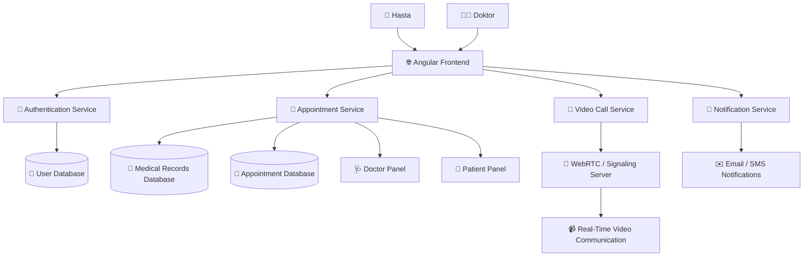

<h1 align="center">🏥 Tele-Sağlık Platformu</h1>
<h3 align="center">Digital HealthTech Solution for Remote Healthcare</h3>

<p align="center">


</p>

---

## 📌 Proje Hakkında

Tele-Sağlık Platformu, hasta ve doktor arasındaki iletişimi dijital ortama taşıyan modern bir sağlık teknolojisi çözümüdür.
Platform sayesinde kullanıcılar online randevu oluşturabilir, doktor ile görüntülü görüşme yapabilir ve sağlık geçmişlerini güvenli şekilde takip edebilir.

Bu proje ekip çalışması, Agile / Scrum metodolojisi ve katmanlı yazılım mimarisi prensipleri doğrultusunda geliştirilmektedir.

---

## ✨ Platform Özellikleri

* 📅 Online randevu oluşturma ve yönetme
* 🎥 Gerçek zamanlı görüntülü doktor görüşmesi
* 📂 Dijital sağlık kayıtlarının takibi
* 🔐 Güvenli kimlik doğrulama sistemi
* 👥 Rol bazlı kullanıcı yönetimi (Hasta / Doktor / Admin)
* 📊 Sağlık geçmişi görüntüleme

---

## 🧠 Yazılım Mimarisi

Proje **Layered Architecture** yapısı ile geliştirilmektedir.

* Presentation Layer
* Business Logic Layer
* Data Access Layer
* Database Layer

---

## 🎥 Video Consultation Architecture



---

## 👥 Proje Ekibi

| İsim              | Rol                               |
| ----------------- | --------------------------------- |
| Halid Hacbekkur   | Scrum Master & Project Management |
| Nedim İsa         | Requirements Analysis             |
| Ömer Doğan        | Technology Research               |
| Zelal Ergin       | Development Environment           |
| Ahmet Akif Yılmaz | Database Design                   |
| Cena İsmail       | Frontend Development              |

---

## 📈 Sprint Progress

Sprint 1

████████░░ **80%**

Sprint 2

██░░░░░░░░ **20%**

---

## 🗺️ Project Roadmap

* ✅ Teknoloji seçimi
* ✅ Geliştirme ortamı kurulumu
* 🔄 Backend API geliştirme
* 🔄 Frontend ekran geliştirme
* ⏳ Authentication sistemi
* ⏳ Video görüşme entegrasyonu
* ⏳ Mobil uyumluluk

---

## 📊 GitHub Stats

<p align="center">


</p>

---

## 📈 Activity Graph

<p align="center">

</p>

---

## 🐍 Contribution Snake

<p align="center">

</p>

---

## 📁 Project Structure

```
tele-saglik-platformu
│
├── backend
├── frontend
├── database
└── docs
```

---

## 🚀 Installation

```
git clone https://github.com/organizasyon/tele-saglik-platformu.git
```

```
cd backend
mvn spring-boot:run
```

```
cd frontend
npm install
ng serve
```

---

## 🤝 Contributors

Halid Hacbekkur
Nedim İsa
Ömer Doğan
Zelal Ergin
Ahmet Akif Yılmaz
Cena İsmail

---

## 📜 License

Educational Project
