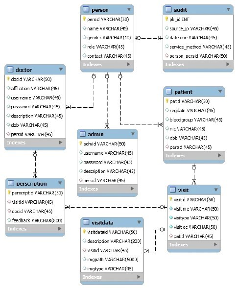

Tele-Sağlık Platformu Veri Modeli
1. Giriş
Bu doküman, tele-sağlık platformu için tasarlanan veritabanı modelini açıklamaktadır. Sistem; hasta, doktor ve yönetici kullanıcılarını, randevu işlemlerini ve tıbbi kayıtları yönetmek amacıyla tasarlanmıştır.
________________________________________
2. Veritabanı Tabloları
Users
Alan	Veri Tipi	Açıklama
id	BIGINT	Primary Key
full_name	VARCHAR(100)	Kullanıcı adı
email	VARCHAR(100)	E-posta
password	VARCHAR(255)	Şifre
phone	VARCHAR(20)	Telefon
role	ENUM	Kullanıcı rolü
created_at	DATETIME	Oluşturulma tarihi
________________________________________
Patients
Alan	Veri Tipi
id	BIGINT
user_id	BIGINT
birth_date	DATE
gender	VARCHAR(10)
address	VARCHAR(255)
blood_type	VARCHAR(5)
________________________________________
Doctors
Alan	Veri Tipi
id	BIGINT
user_id	BIGINT
specialty_id	BIGINT
license_number	VARCHAR(50)
experience_years	INT
________________________________________
Appointments
Alan	Veri Tipi
id	BIGINT
patient_id	BIGINT
doctor_id	BIGINT
appointment_date	DATETIME
status	ENUM
notes	TEXT
________________________________________
3. Tablolar Arasındaki İlişkiler
Users → Patients 1-1
Users → Doctors 1-1
Patients → Appointments 1-N
Doctors → Appointments 1-N
Patients → Medical Records 1-N
Doctors → Medical Records 1-N
Medical Records → Prescriptions 1-N
________________________________________

4. SQL Başlangıç Şeması
CREATE TABLE users (
id BIGINT AUTO_INCREMENT PRIMARY KEY,
full_name VARCHAR(100),
email VARCHAR(100),
password VARCHAR(255),
phone VARCHAR(20),
role ENUM('PATIENT','DOCTOR','ADMIN'),
created_at DATETIME
);

CREATE TABLE patients (
id BIGINT AUTO_INCREMENT PRIMARY KEY,
user_id BIGINT,
birth_date DATE,
gender VARCHAR(10),
address VARCHAR(255),
blood_type VARCHAR(5)
);

CREATE TABLE doctors (
id BIGINT AUTO_INCREMENT PRIMARY KEY,
user_id BIGINT,
specialty_id BIGINT,
license_number VARCHAR(50),
experience_years INT
);

CREATE TABLE appointments (
id BIGINT AUTO_INCREMENT PRIMARY KEY,
patient_id BIGINT,
doctor_id BIGINT,
appointment_date DATETIME,
status ENUM('PENDING','APPROVED','COMPLETED','CANCELLED'),
notes TEXT
);
________________________________________

ER Diyagram Açıklaması
Bu veri modeli, tele-sağlık platformundaki kullanıcı, hasta, doktor ve randevu ilişkilerini göstermektedir. Sistem içerisinde kullanıcılar farklı roller üstlenebilir ve hastalar ile doktorlar arasında randevu ilişkileri kurulabilir. Bu yapı sistemin düzenli ve genişletilebilir bir veritabanı mimarisi ile çalışmasını sağlamaktadır.

# ER Diyagramı

Aşağıda sistemin veritabanı yapısı gösterilmektedir:

Bu ER diyagramı, tele-sağlık platformunun veritabanı yapısını göstermektedir. Sistem içerisinde kullanıcılar hasta veya doktor rolünde olabilir. Hastalar ve doktorlar arasında randevu ilişkileri kurulmaktadır. Randevular sonucunda tıbbi kayıtlar oluşturulabilir ve bu kayıtlar üzerinden reçeteler tanımlanabilir. Bu yapı sistemin düzenli ve genişletilebilir bir veritabanı mimarisi ile çalışmasını sağlamaktadır.

