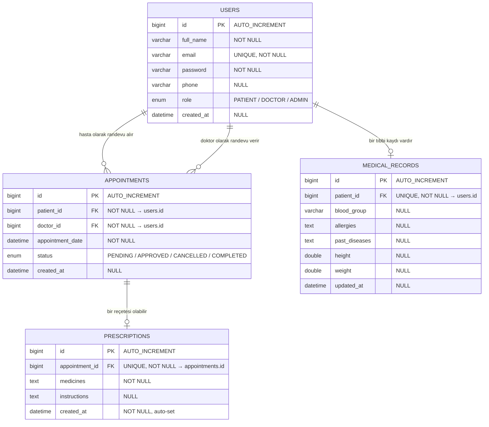

# 🗄️ Veritabanı Şema Tasarımı ve Modelleme

**Proje:** Tele-Sağlık / HealthTech Platformu  
**Görev:** Hafta 1 – Görev 3  
**Sorumlu:** HALİT HACBEKKUR  
**Tarih:** 2026-05-08  
**Versiyon:** 1.0  
**Veritabanı:** MySQL 8.x  
**ORM:** Spring Data JPA + Hibernate  

---

## 1. ER Diyagramı (Entity-Relationship)



---

## 2. Tablo Açıklamaları

### 2.1 `users` – Kullanıcı Tablosu

Sistemdeki tüm kullanıcıları (hasta, doktor, admin) tek tabloda tutar. Rol ayrımı `role` enum alanı ile yapılır.

| Sütun | Veri Tipi | Kısıtlama | Açıklama |
|-------|-----------|-----------|----------|
| `id` | BIGINT | PK, AUTO_INCREMENT | Benzersiz kullanıcı kimliği |
| `full_name` | VARCHAR(255) | NOT NULL | Kullanıcının tam adı |
| `email` | VARCHAR(255) | UNIQUE, NOT NULL | E-posta adresi (giriş için kullanılır) |
| `password` | VARCHAR(255) | NOT NULL | BCrypt ile hashlenmiş şifre |
| `phone` | VARCHAR(255) | NULL | Telefon numarası (opsiyonel) |
| `role` | ENUM | NOT NULL | Kullanıcı rolü: `PATIENT`, `DOCTOR`, `ADMIN` |
| `created_at` | DATETIME | NULL | Hesap oluşturulma tarihi |

**İndeksler:**
- `PRIMARY KEY (id)`
- `UNIQUE INDEX (email)`

---

### 2.2 `appointments` – Randevu Tablosu

Hasta ve doktor arasındaki randevuları yönetir. Her randevunun bir durumu (status) vardır.

| Sütun | Veri Tipi | Kısıtlama | Açıklama |
|-------|-----------|-----------|----------|
| `id` | BIGINT | PK, AUTO_INCREMENT | Benzersiz randevu kimliği |
| `patient_id` | BIGINT | FK → users.id, NOT NULL | Randevuyu alan hasta |
| `doctor_id` | BIGINT | FK → users.id, NOT NULL | Randevuyu veren doktor |
| `appointment_date` | DATETIME | NOT NULL | Randevu tarih ve saati |
| `status` | ENUM | NOT NULL | Randevu durumu |
| `created_at` | DATETIME | NULL | Randevu oluşturulma tarihi |

**Randevu Durumları (AppointmentStatus):**

```
PENDING → Hasta oluşturdu, doktor onayı bekleniyor
APPROVED → Doktor onayladı, görüşme yapılabilir
CANCELLED → İptal edildi (hasta veya doktor tarafından)
COMPLETED → Görüşme tamamlandı
```

**İlişkiler:**
- `patient_id` → `users.id` (ManyToOne) – Bir hasta birçok randevu alabilir
- `doctor_id` → `users.id` (ManyToOne) – Bir doktor birçok randevu verebilir

---

### 2.3 `medical_records` – Tıbbi Kayıt Tablosu

Her hastanın bir adet tıbbi kaydı vardır. Sağlık bilgilerini içerir.

| Sütun | Veri Tipi | Kısıtlama | Açıklama |
|-------|-----------|-----------|----------|
| `id` | BIGINT | PK, AUTO_INCREMENT | Benzersiz kayıt kimliği |
| `patient_id` | BIGINT | FK → users.id, UNIQUE, NOT NULL | Kaydın ait olduğu hasta |
| `blood_group` | VARCHAR(255) | NULL | Kan grubu (A+, B-, O+ vb.) |
| `allergies` | TEXT | NULL | Alerjiler (virgülle ayrılmış) |
| `past_diseases` | TEXT | NULL | Geçmiş hastalıklar |
| `height` | DOUBLE | NULL | Boy (cm) |
| `weight` | DOUBLE | NULL | Kilo (kg) |
| `updated_at` | DATETIME | NULL | Son güncelleme tarihi |

**İlişki:**
- `patient_id` → `users.id` (OneToOne) – Her hastanın **yalnızca bir** tıbbi kaydı olur

---

### 2.4 `prescriptions` – Reçete Tablosu

Doktorun bir görüşme sonrası yazdığı reçeteyi içerir. Her randevuya en fazla bir reçete bağlıdır.

| Sütun | Veri Tipi | Kısıtlama | Açıklama |
|-------|-----------|-----------|----------|
| `id` | BIGINT | PK, AUTO_INCREMENT | Benzersiz reçete kimliği |
| `appointment_id` | BIGINT | FK → appointments.id, UNIQUE, NOT NULL | Reçetenin bağlı olduğu randevu |
| `medicines` | TEXT | NOT NULL | İlaç listesi |
| `instructions` | TEXT | NULL | Kullanım talimatları |
| `created_at` | DATETIME | NOT NULL | Reçete oluşturulma tarihi (@PrePersist ile otomatik) |

**İlişki:**
- `appointment_id` → `appointments.id` (OneToOne) – Her randevunun **en fazla bir** reçetesi olur

---

## 3. Entity İlişki Özeti

| İlişki | Tür | Açıklama |
|--------|-----|----------|
| User → Appointment (patient) | OneToMany | Bir hasta birçok randevu alabilir |
| User → Appointment (doctor) | OneToMany | Bir doktor birçok randevu verebilir |
| User → MedicalRecord | OneToOne | Her hastanın bir tıbbi kaydı vardır |
| Appointment → Prescription | OneToOne | Her randevunun en fazla bir reçetesi vardır |

---

## 4. Enum Tanımları

### 4.1 Role (Kullanıcı Rolü)

| Değer | Açıklama |
|-------|----------|
| `PATIENT` | Hasta – randevu alır, kayıtlarını görür |
| `DOCTOR` | Doktor – randevu onaylar, reçete yazar, tıbbi kayıt oluşturur |
| `ADMIN` | Yönetici – tüm sistemi yönetir |

### 4.2 AppointmentStatus (Randevu Durumu)

| Değer | Açıklama |
|-------|----------|
| `PENDING` | Oluşturuldu, onay bekleniyor |
| `APPROVED` | Doktor tarafından onaylandı |
| `CANCELLED` | İptal edildi |
| `COMPLETED` | Görüşme tamamlandı |

---

## 5. Veritabanı Oluşturma SQL'leri

```sql
-- Veritabanı oluşturma
CREATE DATABASE IF NOT EXISTS telehealth_db
    DEFAULT CHARACTER SET utf8mb4
    DEFAULT COLLATE utf8mb4_unicode_ci;

USE telehealth_db;

-- Kullanıcılar tablosu
CREATE TABLE users (
    id BIGINT AUTO_INCREMENT PRIMARY KEY,
    full_name VARCHAR(255) NOT NULL,
    email VARCHAR(255) NOT NULL UNIQUE,
    password VARCHAR(255) NOT NULL,
    phone VARCHAR(255),
    role ENUM('PATIENT', 'DOCTOR', 'ADMIN') NOT NULL,
    created_at DATETIME DEFAULT CURRENT_TIMESTAMP,
    INDEX idx_email (email),
    INDEX idx_role (role)
);

-- Randevular tablosu
CREATE TABLE appointments (
    id BIGINT AUTO_INCREMENT PRIMARY KEY,
    patient_id BIGINT NOT NULL,
    doctor_id BIGINT NOT NULL,
    appointment_date DATETIME NOT NULL,
    status ENUM('PENDING', 'APPROVED', 'CANCELLED', 'COMPLETED') NOT NULL DEFAULT 'PENDING',
    created_at DATETIME DEFAULT CURRENT_TIMESTAMP,
    FOREIGN KEY (patient_id) REFERENCES users(id) ON DELETE CASCADE,
    FOREIGN KEY (doctor_id) REFERENCES users(id) ON DELETE CASCADE,
    INDEX idx_patient (patient_id),
    INDEX idx_doctor (doctor_id),
    INDEX idx_status (status),
    INDEX idx_date (appointment_date)
);

-- Tıbbi kayıtlar tablosu
CREATE TABLE medical_records (
    id BIGINT AUTO_INCREMENT PRIMARY KEY,
    patient_id BIGINT NOT NULL UNIQUE,
    blood_group VARCHAR(255),
    allergies TEXT,
    past_diseases TEXT,
    height DOUBLE,
    weight DOUBLE,
    updated_at DATETIME DEFAULT CURRENT_TIMESTAMP ON UPDATE CURRENT_TIMESTAMP,
    FOREIGN KEY (patient_id) REFERENCES users(id) ON DELETE CASCADE
);

-- Reçeteler tablosu
CREATE TABLE prescriptions (
    id BIGINT AUTO_INCREMENT PRIMARY KEY,
    appointment_id BIGINT NOT NULL UNIQUE,
    medicines TEXT NOT NULL,
    instructions TEXT,
    created_at DATETIME NOT NULL DEFAULT CURRENT_TIMESTAMP,
    FOREIGN KEY (appointment_id) REFERENCES appointments(id) ON DELETE CASCADE
);
```

---

## 6. Örnek Veriler

```sql
-- Örnek kullanıcılar
INSERT INTO users (full_name, email, password, phone, role) VALUES
('Ali Yılmaz', 'ali@example.com', '$2a$10$...', '05551111111', 'PATIENT'),
('Dr. Ayşe Demir', 'ayse@example.com', '$2a$10$...', '05552222222', 'DOCTOR'),
('Admin User', 'admin@example.com', '$2a$10$...', '05553333333', 'ADMIN');

-- Örnek randevu
INSERT INTO appointments (patient_id, doctor_id, appointment_date, status) VALUES
(1, 2, '2026-05-15 10:00:00', 'APPROVED');

-- Örnek tıbbi kayıt
INSERT INTO medical_records (patient_id, blood_group, allergies, past_diseases, height, weight) VALUES
(1, 'A+', 'Penisilin', 'Astım', 175.0, 72.5);

-- Örnek reçete
INSERT INTO prescriptions (appointment_id, medicines, instructions) VALUES
(1, 'Parol 500mg, Augmentin 1000mg', 'Parol: Günde 3x tok karnına. Augmentin: Günde 2x, 7 gün.');
```

---

## 7. Not: ER Diyagramı Güncelleme

Proje kök dizinindeki `er_diagram.png` dosyası eski tasarıma (person, doctor, patient ayrı tablolar) aittir. Mevcut projede **tek users tablosu + role enum** yaklaşımı kullanıldığından, bu doküman güncel şemayı yansıtmaktadır.

---

*Hazırlayan: HALİT HACBEKKUR (Scrum Master) | Tarih: 2026-05-08*
